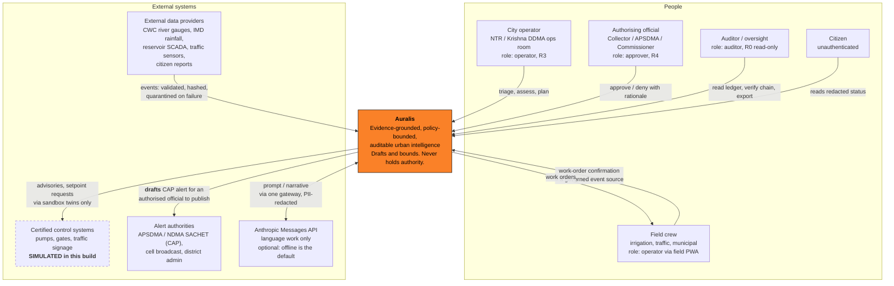

# C1 — System context

Auralis sits between untrusted city data and authorised city action. It never
holds authority of its own: it drafts, grounds, bounds and records. A person or
a certified system does the thing.

Pilot jurisdiction: **Vijayawada, NTR / Krishna district, Andhra Pradesh,
India** — Krishna river and the Budameru rivulet. The flagship scenario mirrors
the September 2024 Budameru breach.

## Actors and what each may actually do

| Actor | Role / tier cap | May do | May never do |
|---|---|---|---|
| City operator | `operator`, unassisted **R3**, hard cap R4 | Triage incidents, run assessment, generate candidate plans, execute R0–R3 actions, raise work orders | Execute an R4 alone; self-approve their own R4 |
| Authorising official | `approver`, **R4** | Approve/deny with recorded rationale and `authority`; one of the two required at R4 | Exceed R4; approve twice to satisfy dual control (`valid_approvals` de-duplicates by approver id) |
| Field crew | `operator` via `/field` PWA | Receive work orders, record field confirmation — which writes through the same audit path as anything else | Bypass the gateway; field sync is an event source, not a back door |
| Citizen | unauthenticated `public`, **R0** | Read `/v1/public/status`: verified incidents only, redacted, with a deliberate `disclosure_delay_s` | See raw operational detail, unverified incidents, or personal data |
| Auditor | `auditor`, **R0 read-only** | Read the ledger, verify the hash chain, export a workflow, replay it | Act. `ROLE_HARD_MAX['auditor'] = 'R0'` — an auditor cannot execute anything |
| External data providers | connector, not a principal | Submit events that are validated, content-hashed, deduplicated and (on failure) quarantined | Set their own `trust_tier` — it is copied from the connector row |
| Certified control systems | target of an action | Receive setpoint/advisory requests through registered tools with sandbox twins | Be commanded directly — `scada.direct_control` is permanently denied (R5) |
| Alert authorities | recipient of a draft | Receive a CAP-shaped draft with severity, headline and named `authority` | — Auralis never publishes on its own authority; see `docs/compliance-map.md` |
| Anthropic API | external service | Receive redacted, sanitised prompts through `agents/llm_gateway.py` | Influence a number, a tier, a policy outcome or an effect (ADR 0001, 0002) |

## The two statements this diagram exists to make

1. **The arrow to alert authorities is a draft, not a publication.** Under the
   Disaster Management Act 2005 the alerting authority is statutory — SDMA at
   state level, the District Collector as ex-officio DDMA chair at district
   level, with CWC and IMD as the recognised alert-generating agencies for
   floods and rainfall. Auralis produces a CAP draft; a person with authority
   publishes it. `alert.publish_cap` is R4, irreversible, dual-controlled, and
   verified by `human_confirmation` — not by reading our own database.

2. **The arrow to control systems is dashed because it is simulated.** Every
   integration in this build runs against `tools/sandbox.py` twins operating on
   the SQLite twin. No packet reaches real infrastructure. `scada.direct_control`
   is registered *only* so the policy engine can be seen refusing it.
