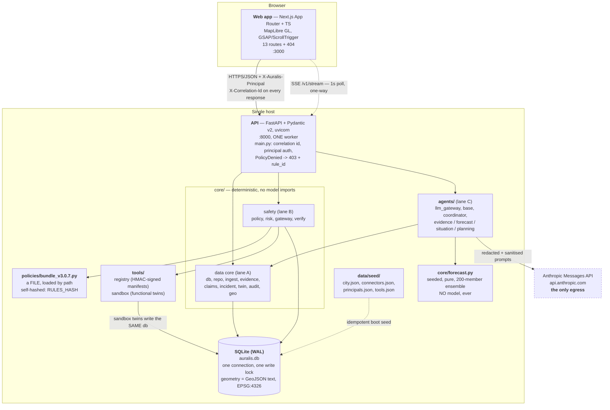

# C2 — Containers

Deployment reality of this build: **two processes on one machine**. A Next.js
dev server on :3000, a single uvicorn worker on :8000, and a SQLite file. There
is no message broker, no cache server, no container orchestration, and no
Docker requirement. That is a deliberate slice decision (ADR 0006), not an
omission.

## Responsibilities

| Container | Responsibility | Key constraint |
|---|---|---|
| **Web app** (`apps/web`) | Command centre, public portal, field PWA. Renders evidence chips, claim blocks, risk badges, verification states. `lib/api.ts` is the only path to the API and never throws on a dead API — callers get `error` and the UI stays usable | Severity, verification and permission are **never colour-only**; always label + icon. WCAG 2.2 AA is a gate (`docs/compliance-map.md`) |
| **API** (`services/api/main.py`) | Correlation id on every request, principal resolution before any router logic, exception → error envelope. `PolicyDenied` renders as **403 with the exact `rule_id`**, not 500 — a denial is the architecture working | Coordinator-owned; lanes do not edit. Routers are thin, all logic is in `core/` and `agents/` |
| **core — data (lane A)** | Ingest pipeline, evidence minting and conflicts, claims ledger, incident detection + state machine, twin traversal, audit chain, geometry | `core/geo.py` is the only module that touches coordinates. `repo.py` requires `tenant_id` positionally on every list function |
| **core — safety (lane B)** | Risk tier computation, policy evaluation and decision logging, the tool gateway chain, read-back verification and rollback | `core/policy.py` never imports `agents/**`; a test enforces it |
| **agents (lane C)** | Language work only: evidence summarisation, forecast narration, situation synthesis, plan drafting, coordination and arbitration | Every agent takes **one immutable evidence snapshot by id** and never re-reads live evidence mid-run. The coordinator makes no external writes and never imports `core/gateway.py` |
| **core/forecast.py** | The numbers. Seeded `random.Random(seed)`, 200 ensemble members, declared operating envelopes, DOWNGRADE or ABSTAIN outside them | Pure in (kwargs, seed). No model, no I/O, no `now()` |
| **tools/** | Signed manifests (`registry`) and functionally-equivalent sandbox twins (`sandbox`). A twin really writes a setpoint a later read-back observes | Empty `sandbox_ref` ⇒ registration rejected. `write=True` with no `verification_method` ⇒ registration rejected |
| **SQLite** | Everything. Events, evidence, claims, twin, plans, actions, approvals, policy decisions, audit chain, agent runs, simulations | One process, one write lock. See ADR 0006 for what that costs and when to swap |
| **Policy bundle** | The rules, as a versioned hashed file outside the application | Loaded by path via `importlib`, memoised per version — a change needs a restart |

## Cross-container contracts

- **Wire format** is snake_case JSON defined by `services/api/models.py`;
  `apps/web/lib/types.ts` mirrors it verbatim. Both are coordinator-owned.
- **Auth** is the header `X-Auralis-Principal: <principal_id>`. Stated plainly:
  there is **no secret** behind it (ADR 0012). Never expose beyond localhost.
- **Realtime** is SSE, not WebSocket — one-way server push is all this needs and
  it survives proxies and reconnects for free. `repo.poll_stream` on a 1s tick.
- **Errors** are `{"error":{"code","message","detail","correlation_id"}}`. A
  policy denial is **200 on the plan view** (it is data the UI renders) and
  **403 on execute** with `code="policy_denied"` plus `rule_id` and `reason`.
- **Egress**: `api.anthropic.com` is the only outbound host, reached only from
  `agents/llm_gateway.py`. Every other network path in this build is absent, not
  firewalled — there is nothing else to call.

## What is not here (and should not be inferred)

No broker, no worker pool, no Redis, no object store, no identity provider, no
secrets manager, no reverse proxy, no WAF, no observability backend. The ops
metrics at `/v1/metrics/ops` are computed by SQL over the same database. For a
prototype this is correct; `docs/production-gap.md` lists what production adds.
