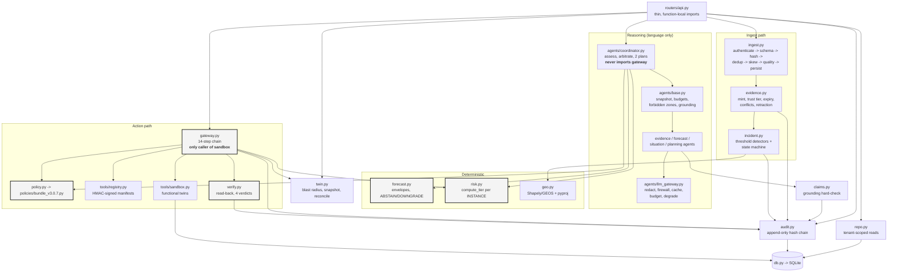

# C3 — Components inside the API

One module per responsibility, and the import direction is the safety property:
`core/` never imports `agents/`. That is not style — it is what makes "policy
lives outside the model" true rather than asserted.



Boxed in heavy outline: modules that must never see model output.

## Component responsibilities

| Module | Owns | The one thing that matters |
|---|---|---|
| `core/ingest.py` | 8-stage ingest: authenticate, schema, content hash, dedup, clock skew, quality, persist, mint+detect | **Quarantine never deletes.** A bad row is stored with `quarantined=1` and a reason and stays queryable. Every outcome writes an audit event |
| `core/evidence.py` | Minting, trust tier, expiry, conflict detection, retraction, expiry propagation | `trust_tier` is copied from the connector — never inferred, never model-set. Conflicts resolve by precedence, and the loser stays visible |
| `core/incident.py` | Threshold detectors (water level, rainfall, traffic collapse, cyber) and the 7-state machine | Detection is **rules only**. The rule id lands in `incident.detector`, so "why did this open?" never needs a model. Thresholds are read from the asset, not from a constant |
| `core/claims.py` | The claims ledger; invariant 1 | `check_grounding` raises on an empty `evidence_ids` for fact/forecast **or** a cited id that does not exist. Exception, not warning |
| `core/twin.py` | BFS blast radius, point-in-time snapshot, state reconciliation | `blast_radius` is a policy input, not a visualisation. Three states per asset (current/reported/desired) make drift detectable |
| `core/audit.py` | Append-only chain, verification, self-contained export | No `update()`, no `delete()`. `verify_chain` names the first break and its cause |
| `core/geo.py` | All coordinate work | Geodesic WGS84 distances; metric buffers via a local AEQD projection, never EPSG:3857. Positional accuracy combined in quadrature |
| `core/forecast.py` | Flood depth and traffic degradation | Declares an envelope and **abstains** outside it. `None` means unknown and nothing downstream may fill it in |
| `core/risk.py` | `compute_tier(action_class, criticality, blast, evidence_age, public_facing, reversible)` | Tier is per action **instance**. Escalation caps at R4; only an action class that *is* physical control yields R5 |
| `core/policy.py` + `policies/` | Rule evaluation, decision persistence, replay, rule catalogue | `normalize()` drops everything not in `CTX_KEYS`, and `args` is not in `CTX_KEYS` |
| `core/gateway.py` | The 14-step execute chain, kill switch | Only caller of `sandbox.call`. Re-reads live facts and recomputes the tier at execution time — the approval is never trusted alone |
| `core/verify.py` | Read-back comparison, four verdicts, rollback | Timeout ⇒ `UNKNOWN`. Never `failed`, never assumed success |
| `tools/registry.py` | Manifest registration, HMAC signing, role-filtered visibility | Registration gates: non-empty `sandbox_ref`; write tools must declare `verification_method` |
| `tools/sandbox.py` | Functional twins against the SQLite twin | Not stubs. `pump.setpoint` really writes a setpoint a later read-back observes. Deliberate `TIMEOUT_TOOLS` / `DRIFT_TOOLS` injection makes the UNKNOWN and DIFFERENCE paths demonstrable |
| `agents/base.py` | Agent runtime: spec, immutable snapshot, budgets, forbidden zones, grounding, `agent_run` logging | An agent gets **one snapshot by id** and derives every time fact from `snapshot.taken_at`, never `now()`. Replaying an old snapshot reproduces the old answer exactly. An ungrounded statement is **dropped and the drop is recorded** — never softened to "low confidence" |
| `agents/coordinator.py` | Task assignment, disagreement reconciliation, exactly two candidate plans | **Does not average.** No mean, no midpoint, no blended consensus value. Disagreements are enumerated with each position's own evidence, then resolved by source precedence or escalated to a human, and written as `agent.disagreement` |
| `agents/llm_gateway.py` | The only path to a provider (ADR 0014) | Never raises. PII redaction runs before any byte leaves the process; the context firewall is defence in depth only and says so in its own comment |
| `core/repo.py` | Tenant-scoped typed reads for the routers | `tenant_id` is a required positional argument — a missing tenant is a `TypeError`, not a silent cross-tenant read |

## Import rules that are enforced, not merely intended

```
core/policy.py   ─╳→  agents/**        # tested
core/risk.py     ─╳→  agents/**
agents/coordinator.py ─╳→ core/gateway.py
routers/**       ─╳→  tools/sandbox.py  # only core/gateway.py may call it
```

Everything else in `services/api/` may import `core/`. Nothing in `core/` may
import `agents/`.
