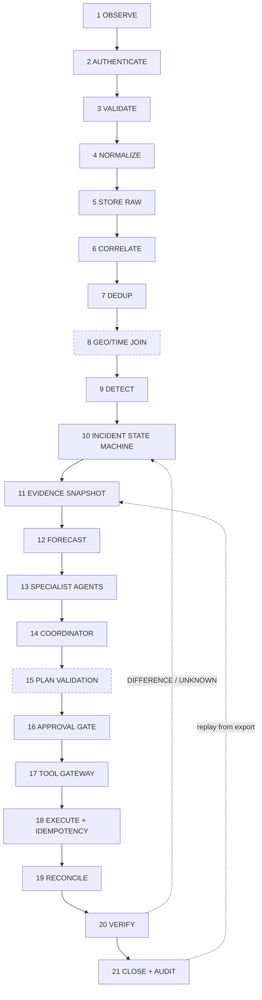

# Data flow — observation to closed and audited

The end-to-end pipeline, with the module that implements each stage in **this
repository**. Stages that are simplified, or not implemented at all, are marked.
An accurate gap is worth more than a confident fiction.

Status key: **✅ implemented** · **◐ simplified** · **⛔ not implemented**



---

## Stage by stage

### 1. OBSERVE — ✅
`POST /v1/events` (`routers/api.py::post_event`). `EventIn` carries
`connector_id`, optional `source_event_id`, `kind`, `event_time`, `payload`,
optional GeoJSON `geometry`, `schema_version`.

**Simplification:** there is no poller, no subscriber and no connector runtime.
Sources push into the endpoint; the demo driver and seed data supply the traffic
(`data/seed/connectors.json`). Real feeds with SLAs are a production
requirement, not a slice one.

### 2. AUTHENTICATE — ◐
`main.py::get_principal` (unknown → 401, non-active → 403), then
`ingest._principal` re-checks, then connector-belongs-to-tenant in
`ingest.ingest_event` step 1.

**Simplified, and this is the big one:** the credential is a bare
`X-Auralis-Principal` header with **no secret**. Connector identity is asserted
by id, not proven — no mTLS, no per-connector key, no payload signature.
See ADR 0012 and `docs/production-gap.md`.

### 3. VALIDATE — ✅
`ingest._schema_errors` against `ingest.CONTRACTS[kind]`: required fields,
numeric typing, enum membership, ISO-8601 `event_time`, geometry must be a
GeoJSON object. Failure ⇒ reject with the field-level reason and **no row**.

### 4. NORMALIZE — ✅
`evidence.mint` writes one shape for every measurement so cross-source
comparison is a SQL problem, not a parsing problem:

```json
{"subject":"<ref>:<metric>","metric":"...","value":3.4,
 "unit":"m","ref":"<asset/station id>","payload":{"...raw..."}}
```

`evidence.subject_of` derives a stable subject; `evidence.value_of` pulls the
number from the first recognised field (`level_m`, `rate_mm_h`, `flow_vph`,
`speed_kph`, `value`).

**Simplification:** unit conversion is a lookup table (`evidence.UNITS`), not a
unit algebra. A source reporting feet would need a contract entry, not a
conversion.

### 5. STORE RAW — ✅
`raw_payload` table keyed by `content_hash` = SHA-256 of the canonical JSON body.
`INSERT OR IGNORE`, so the raw bytes behind any event are recoverable and
immutable. `event.content_hash` references it.

### 6. CORRELATE — ✅
`incident._correlate(tenant_id, incident_class, geometry, at)`: an event joins
an existing open incident of the same class within **500 m** and **30 minutes**,
otherwise a new incident opens. Distances are geodesic via `core/geo.py`.

### 7. DEDUP — ✅
`ingest.ingest_event` step 4 on `(connector_id, source_event_id, content_hash)`,
backed by a UNIQUE constraint in `schema.sql`. A duplicate returns the original
event id, its evidence id and its quarantine state, and writes an
`ingest.deduplicated` audit event. No second row, no second detection.

### 8. GEO/TIME JOIN — ◐
`incident._asset_for(event_row)` attaches an event to the nearest asset within
**250 m** (`ASSET_MATCH_M`), widened by combined `geometry_accuracy_m` via
`geo.within_m`. Time joining is the 30-minute correlation window in stage 6.

**Simplified:** this is a nearest-asset proximity match, not a spatial join
against an authoritative GIS. There is no ward/zone polygon join, no road
network snap, no catchment or drainage-network topology. Candidate selection is
a table scan (no spatial index — ADR 0006).

### 9. DETECT — ✅
`incident.detect` runs threshold rules only — no ML, no LLM:

| Rule | Trigger |
|---|---|
| `_water_level` | level ≥ asset threshold (default 3.0 m, overridden per asset) |
| `_rainfall` | ≥ 30 mm/h major, ≥ 50 mm/h critical |
| `_traffic_collapse` | flow below 30% of baseline |
| `_cyber` | severity enum from the connector |

The firing rule id is stored in `incident.detector` and named in the audit
event, so "why did this open?" is answerable without a model.

### 10. INCIDENT STATE MACHINE — ✅
`incident.TRANSITIONS`, enforced by `incident.transition` which raises
`IllegalTransition` on an undeclared edge:

```
detected → assessing → planning → awaiting_approval → acting → verifying → closed
                          ↑______________|                        |
awaiting_approval → planning (re-plan)          verifying → acting (retry)
any state → closed
```

### 11. EVIDENCE SNAPSHOT — ✅
`evidence_snapshot` (id, `taken_at`, `evidence_ids`, `snapshot_hash`, body).
`agents/base.Snapshot` is immutable and given to an agent **by id**. An agent
never re-reads live evidence mid-run, and derives every time fact from
`snapshot.taken_at` rather than `now()` — so replaying an old snapshot tomorrow
reproduces today's answer exactly.

### 12. FORECAST — ✅
`core/forecast.py`. Pure in (kwargs, seed), `random.Random(seed)` per call,
200 ensemble members, p10/median/p90. Two models, both version-pinned:
`flood-depth-curve-1.2.0`, `traffic-degradation-1.1.0`.

Outside the declared `Envelope` the model **says which** of two things it did:
`DOWNGRADE` (clamp to the bound, widen the interval, `in_envelope=False`,
`envelope_note`) or `ABSTAIN` (`median/p10/p90 = None`). Nothing is extrapolated.

**Simplification:** these are calibrated parametric curves, not hydraulic
routing. They are honest about their envelope, and they are not a 2D flood
model. See ADR 0011.

### 13. SPECIALIST AGENTS — ✅ (language only)
`agents/evidence_agent.py`, `forecast_agent.py`, `situation.py`,
`planning.py`, on the `agents/base.Agent` runtime: declared scope, allowed
domains, allowed tools, wall-clock budget, tool-call budget, forbidden zones
(`agent.forbidden_zone_blocked`), schema-validated Pydantic output, and an
`agent_run` row with prompt version, model version and snapshot id.

Grounding is checked here (`base.check_grounding`) and again in
`core/claims.py`. An ungrounded statement is **dropped**, and the drop is
recorded as `claim.dropped_unsupported` — never softened into a "low
confidence" claim.

All model traffic goes through `agents/llm_gateway.py`, which redacts PII on
the outbound variable tree, runs the context firewall, caches, enforces a
persisted per-workflow token/cost budget, and **never raises** — with no API
key every agent runs its deterministic generator and reports `degraded=True`.

### 14. COORDINATOR — ✅
`agents/coordinator.py`. Assigns tasks, reconciles specialist outputs, produces
exactly **two** candidate plans with tradeoffs.

The load-bearing rule: **it does not average.** No mean, no midpoint, no blended
consensus value anywhere. Each disagreement is enumerated with every position's
own evidence attached, then resolved by deterministic source precedence
(`statutory > certified > verified > crowdsourced > unknown`) or — when the top
tier is tied — escalated to human review under
`rule.arbitration.tie_requires_human.v1`. Either way it is written to the ledger
as an `agent.disagreement` event.

The coordinator never imports `core/gateway.py` and causes no effect outside the
database.

### 15. PLAN VALIDATION — ◐
Real: `agents/planning.filter_candidates` drops any action naming a tool outside
the principal's visible catalogue and records
`plan.action_dropped_out_of_catalogue`. `coordinator._persist_plan` computes a
risk tier per action via `core/risk.py` and stores `validation` and
`objective_score` on the plan. `POST /v1/plans` returns per-action policy
decisions so a denial is visible **as data** on the plan view (HTTP 200), before
anyone tries to execute.

**Simplified:** there is no cross-action conflict checker (two actions targeting
the same asset with contradictory intent), no temporal ordering constraint
solver, and no resource-contention check. Sequencing is an integer column.

### 16. APPROVAL GATE — ◐
The policy side is fully implemented: `ROLE_TIER`, `DUAL_CONTROL` (two
**distinct unexpired** approvers, de-duplicated by `approver_id`),
`REVERSIBILITY_REQUIRED`, `EMERGENCY_OVERRIDE` (reason code plus a second
approver who is not the requester), and re-checking of approvals at execution
time (gateway step 10). The `approval` table records approver, `authority`,
rationale, `decided_at`, `expires_at`, `dual_control_of`.

**⛔ Gap on disk at time of writing:** `routers/api.py::approve` calls
`gateway.record_approval(plan_id, body, principal)` and **that function does not
exist in `core/gateway.py`**. `POST /v1/plans/{id}/approve` will raise
`AttributeError` until lane B adds it. The rules it feeds are implemented; the
write path is not.

### 17. TOOL GATEWAY — ✅
`core/gateway.py::execute` — the 14-step chain (ADR 0003, and the crossing-C
table in `trust-boundaries.md`). Every refusal writes `action.blocked` with the
code, message and `rule_id` before raising.

### 18. EXECUTE WITH IDEMPOTENCY — ✅
Step 11: the key must be globally unique across actions (`idempotency_key` is
UNIQUE in `schema.sql`); a repeat of the *same* key on the *same* action returns
the first result, writes `action.idempotent_replay`, and creates no second
effect. The action is set to `executing` before the tool is called, so a crash
mid-flight is visible rather than invisible.

Execution reaches `tools/sandbox.py`, which is **functionally equivalent, not
stubbed** — `pump.setpoint` really writes a setpoint a later read-back observes,
`workorder.create` really inserts a `work_order` row. Nothing reaches a network.

### 19. RECONCILE — ✅
`gateway.intended_state(tool_id, args, result)` records what the action meant to
achieve; `core/verify.py::_readback` re-reads the asset's actual state.
`core/twin.py::reconcile` does the same comparison at estate scale, finding
assets whose `current`/`reported`/`desired` states have diverged for a sustained
period (default 300 s).

### 20. VERIFY — ✅
`core/verify.py`. SUCCESS / DIFFERENCE / FAILED / UNKNOWN, mapped to action
status `verified` / `difference` / `failed` / `unknown`. **A timeout is
`UNKNOWN`** — never `failed`, never assumed success — and the gateway does not
retry. `alert.publish_cap` uses `human_confirmation`, not read-back: a database
row does not prove a siren sounded.

`sandbox.TIMEOUT_TOOLS` and `sandbox.DRIFT_TOOLS` inject these paths on demand,
so UNKNOWN and DIFFERENCE are demonstrable rather than theoretical.

### 21. CLOSE + AUDIT — ✅
`core/audit.py` has appended at every prior stage. `GET /v1/audit/{workflow_id}`
returns the ordered slice; `GET /v1/audit/verify` recomputes the whole chain and
names the first break; `GET /v1/audit/{workflow_id}/export` emits a
**self-contained** JSON that replays the workflow with no live database.

---

## Known drift between the router surface and the modules on disk

Recorded because it is real at the time of writing, and because
`docs/CONTRACT.md` is the authority both sides must converge on. Every item
below is a router in `routers/api.py` calling a function whose signature or name
does not exist in `core/`:

| Route | Router calls | On disk | Effect |
|---|---|---|---|
| `POST /v1/plans/{id}/approve` | `gateway.record_approval(plan_id, body, principal)` | **absent** | AttributeError |
| `POST /v1/admin/agents/{id}/revoke` | `revoke_agent(agent_id, principal, second_approver_id, reason)` | `revoke_agent(agent_id, approver_a, approver_b)` | wrong arity / wrong argument meaning |
| `GET /v1/audit/{id}/export` | `audit.export_workflow(workflow_id, tenant_id)` | `export_workflow(workflow_id)` | TypeError |
| `GET /v1/twin/query` | `twin.query(asset_id, depth, tenant_id)` | `query(asset_id, depth)` | TypeError |
| `GET /v1/incidents/{id}` | `repo.incident_detail(tenant_id, incident_id)` | `incident_detail(incident_id, degraded)` | arguments transposed |
| `GET /v1/evidence/{id}` | `repo.get_evidence(tenant_id, evidence_id)` | `get_evidence(evidence_id)` | TypeError |
| `GET /v1/actions` | `repo.list_actions(tenant_id)` | `list_actions(plan_id)` | wrong scope |
| `GET /v1/data-health` | `repo.data_health(tenant_id)` | `connector_health(tenant_id)` | name mismatch |
| `GET /v1/plans/{id}` | `repo.plan_detail(...)` | **absent** | AttributeError |
| `GET /v1/audit/{id}` | `repo.audit_slice(...)` | `list_audit(workflow_id)` | name mismatch |
| `GET /v1/stream` | `repo.poll_stream(last_seq)` | **absent** | stream emits `error` events |
| `/v1/public/status`, `/v1/field/work-orders`, `/v1/simulations`, `/v1/demo/*` | `repo.public_status`, `repo.list_work_orders`, `repo.update_work_order`, `repo.list_simulations`, `core.simulator.*`, `core.seed` | **absent modules/functions** | routes non-functional |

`core/simulator.py` and `core/seed.py` do not exist yet; `main.py`'s lifespan
seeding is wrapped in a `try/except` so a cold start still boots. `scripts/` is
empty, so `scripts/seed_db.py` and `scripts/run_demo.py` referenced in
`README.md` are not present either.

None of this changes the safety architecture — the ingest, evidence, claims,
policy, gateway, verification and audit paths are implemented and testable
directly. It does mean parts of the HTTP surface described in
`docs/CONTRACT.md` are not yet reachable end to end.
