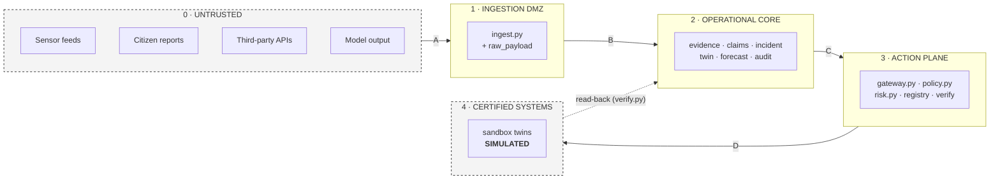

# Trust boundaries

Five zones, four crossings. Each crossing lists what is **actually enforced in
this build**, and what is not.

**Model output sits in zone 0.** That is the single most important placement on
this diagram. Text a model produced is untrusted input, not a system voice.

---

## Crossing A — Untrusted → Ingestion DMZ

| Enforced | Where |
|---|---|
| Principal must exist and be `active` | `main.py::get_principal`, then `ingest._principal` re-checks |
| Connector must exist **and belong to the caller's tenant** | `ingest.ingest_event` step 1 → reject, no row |
| Body must satisfy the connector contract: required fields, numeric types, enums, ISO-8601 `event_time`, GeoJSON-object geometry | `ingest._schema_errors` → reject, no row |
| Raw body content-hashed (SHA-256 of canonical JSON) and stored immutably | `raw_payload` table, `INSERT OR IGNORE` |
| Deduplication on `(connector_id, source_event_id, content_hash)` | unique constraint + explicit pre-check |
| Clock skew: >24 h past or >5 min future ⇒ **quarantine** | `ingest` step 5 |
| Physically impossible values (e.g. rainfall outside 0–400 mm/h) ⇒ **quarantine** | `ingest._quality_errors` |
| Every outcome — accepted, rejected, deduplicated, quarantined, released — writes an audit event | `ingest.log()` |

**Not enforced here:** no transport authentication of the source (no mTLS, no
signed payloads, no API keys per connector), no rate limiting on ingest, no
payload size cap. A connector id is asserted, not proven.

---

## Crossing B — Ingestion DMZ → Operational core

| Enforced | Where |
|---|---|
| Quarantined events **never mint evidence** — they are stored and excluded until a human runs `release_from_quarantine` with a reason | `ingest` step 8 guard |
| `trust_tier` is copied from the connector row, never from the payload | `evidence.mint` |
| `expires_at = observed_at + connector.freshness_sla_s` — expiry is a source-contract property | `evidence.mint` |
| `integrity_hash` computed on mint; `verify_integrity()` recomputes | `evidence.py` |
| `evidence_class` set explicitly; `synthetic` can never render as observed | `models.py` + UI invariant 9 |
| Cross-source contradictions detected on a normalised subject, resolved by precedence, loser preserved | `evidence.detect_conflicts` |
| Detection is threshold rules only, rule id stored in `incident.detector` | `incident.detect` |
| A model statement enters only as a `claim` and only if grounded — otherwise dropped, and the drop recorded | `agents/base.py` + `core/claims.py` |
| Agents read an **immutable snapshot by id**, never live evidence mid-run | `agents/base.Snapshot` |

**Not enforced here:** evidence integrity is an internal hash, not a signature
— it proves the row was not corrupted, not that the source sent it.

---

## Crossing C — Operational core → Action plane

This is the crossing that matters, and it is one function: `gateway.execute`.
The full 14-step chain is in ADR 0003. The properties this boundary provides:

| Enforced | Where |
|---|---|
| Args validated against the signed `input_schema` before anything else runs | step 2 |
| Manifest signature re-verified on every execution — an edited manifest becomes invalid, not authoritative | `registry.require` |
| Tool visibility filtered by role **and** tier grant; visibility re-checked, and never treated as permission | step 3 + step 7 |
| Revoked identity refused; an `agent` principal with no `spiffe_id` refused | step 4 + `IDENTITY_VALID` |
| Tenant mismatch refused (principal, resource and asset tenants must agree) | step 5 + `TENANT_MATCH` |
| **Simulation barrier**, checked twice independently — in the gateway before policy runs, and again as a policy rule | step 6 + `SIMULATION_BARRIER` |
| Policy evaluated over a **projected** context that excludes `args`; decision persisted with inputs and hash | step 7 |
| Live re-read: asset criticality, blast radius, evidence age/status — **approval-time values are never reused** | before step 7 |
| Evidence freshness rechecked at execution; per-asset `permitted_actions` allow-list enforced | step 8 |
| Risk re-computed; refuse if the tier is now above the approved tier | step 9 |
| R4/R5 need two distinct unexpired approvals; break-glass needs a reason code and a different second approver | `DUAL_CONTROL`, `EMERGENCY_OVERRIDE` |
| Idempotency key unique across actions; a replay returns the first result and creates no second effect | step 11 |
| Response validated against `output_schema`; a mismatch fails the action | step 13 |
| Every refusal writes an `action.blocked` audit event before raising | `gateway.fail()` |

**Not enforced here:** nothing prevents a developer with repository access from
adding a module that imports `sandbox` directly. The single-action-path property
is architectural and test-enforced, not runtime-enforced.

---

## Crossing D — Action plane → Certified systems

| Enforced | Where |
|---|---|
| Only registered tools with a non-empty `sandbox_ref` exist at all | `registry.register` |
| Write tools must declare a `verification_method` or registration is rejected | `registry.register` |
| `scada.direct_control` is denied by `R5_PROHIBITED` before execution, **and** its sandbox raises `ProhibitedTool` if ever reached — two independent refusals | `bundle::_c_prohibited`, `sandbox._scada_direct` |
| Timeout ⇒ status `unknown`, verification `UNKNOWN`, no retry | `gateway._on_timeout` |
| Read-back comparison decides SUCCESS / DIFFERENCE / FAILED / UNKNOWN | `verify.verify` |
| A public alert is verified by `human_confirmation`, not by reading our own database | `alert.publish_cap` manifest |
| `egress_allowlist` is a declared manifest field | `tool_manifest` |

**Not enforced here, stated plainly:**
- **Every integration is simulated.** `tools/sandbox.py` writes to the same
  SQLite database. No packet leaves the host for a control system.
- `egress_allowlist` is **declared but not enforced** — there is no network
  egress filter in this build. It is a schema field waiting for a real
  integration layer.
- There is no certificate pinning, no protocol gateway, no OT-network
  segmentation, because there is no OT network.

---

## Zone-crossing summary

| Crossing | Strongest control | Weakest link in this build |
|---|---|---|
| A | Contract validation + quarantine-never-drop | Source identity is asserted, not authenticated |
| B | Trust tier copied from connector; grounding hard-check | Integrity hash is internal, not a signature |
| C | `gateway.execute` — 14 gates, live re-read, audit on every refusal | Principal header carries no secret (ADR 0012) |
| D | Two independent refusals of R5; timeout ⇒ UNKNOWN | Everything is simulated; `egress_allowlist` is not enforced |
